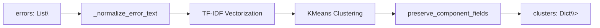
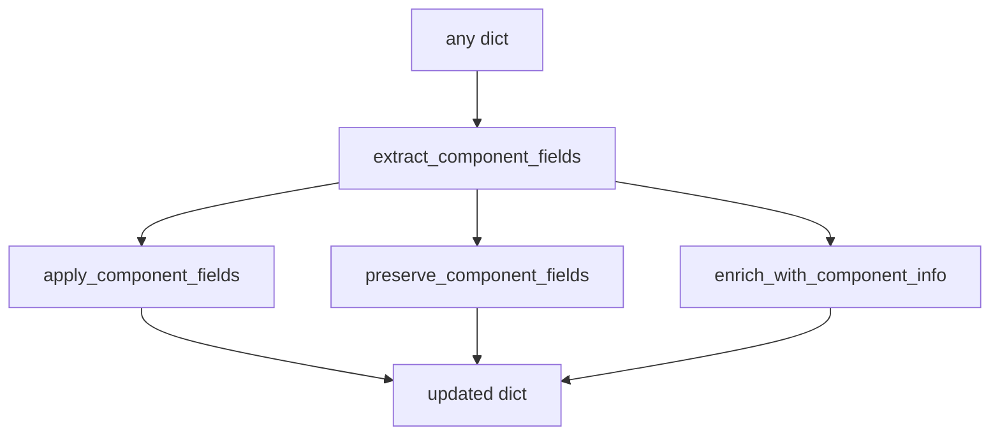
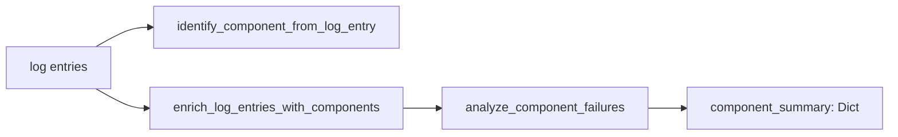
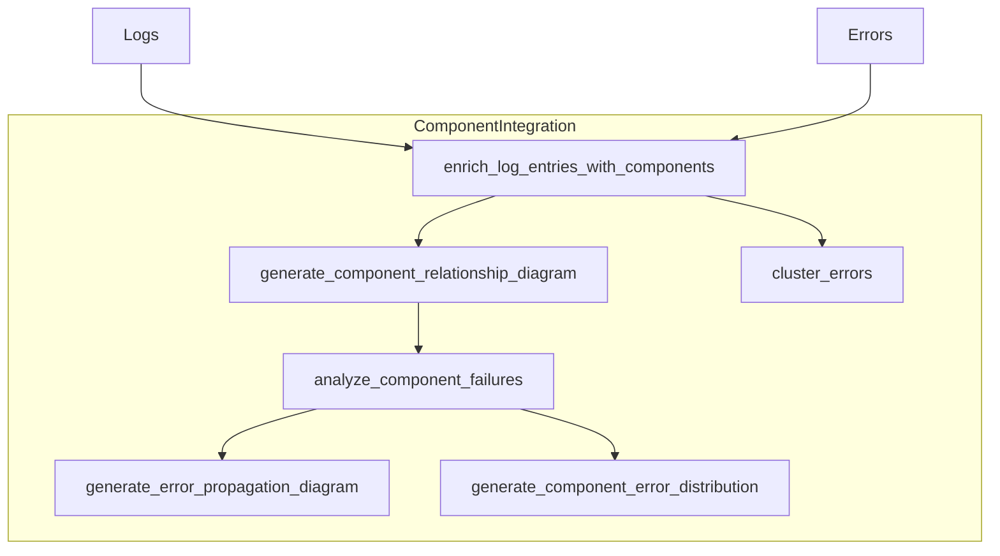
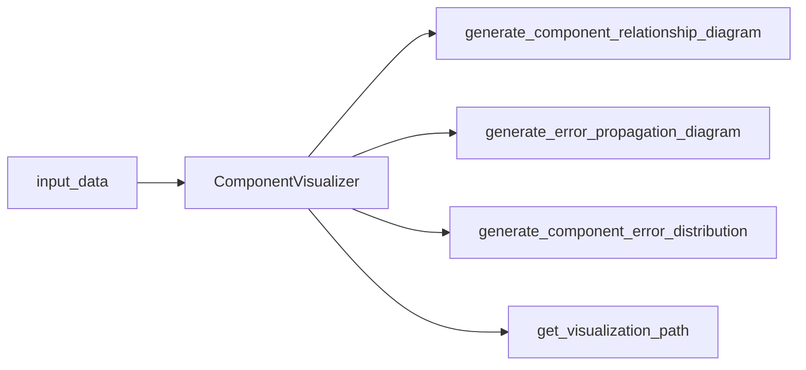

# Orbit Analyzer: Component Algorithm Interfaces

This document provides a comprehensive overview of the component analysis subsystem interfaces within the Orbit Analyzer system. Each module's interfaces, behaviors, and relationships are documented to facilitate integration, maintenance, and extension.

## Table of Contents
- [1. Error Clustering](#1-error-clustering)
- [2. Context-Aware Error Clustering](#2-context-aware-error-clustering)
- [3. Component Utilities](#3-component-utilities)
- [4. Schema-Based Component Analysis](#4-schema-based-component-analysis)
- [5. Component Integration](#5-component-integration)
- [6. Component Visualization](#6-component-visualization)
- [7. Visualization Utilities](#7-visualization-utilities)
- [8. Path Utilities & Validation](#8-path-utilities--validation)
- [9. Component Verification](#9-component-verification)

## 1. Error Clustering
*Module: error_clusterer.py*



### Public Interfaces

#### `perform_error_clustering(errors: List[Dict], num_clusters: int = None) -> Dict[int, List[Dict]]`
Main entry point for grouping similar errors by text similarity, with automatic component-field preservation.

**Parameters:**
- `errors`: List of error dictionaries
- `num_clusters` (optional): Desired number of clusters; if None, an optimal value is determined heuristically

**Returns:**
- `Dict[int, List[Dict]]`: Mapping from cluster ID to list of error dictionaries

**Behavior:**
- Normalizes variable text (timestamps, UUIDs, memory addresses)
- Converts texts to TF-IDF vectors
- Picks number of clusters via `_determine_optimal_clusters`
- Applies K-means, rebalances overly large clusters, and preserves original component fields

#### `cluster_errors = perform_error_clustering` 
Alias for backward compatibility.

#### `_normalize_error_text(text: str) -> str`
Replaces sensitive patterns with placeholders and lowercases, improving clustering quality.

#### `_determine_optimal_clusters(matrix: np.ndarray, num_errors: int, user_specified: Optional[int] = None) -> int`
Heuristic: uses √(num_errors/2) capped between 2 and a max (default 8), also constrained by feature density.

## 2. Context-Aware Error Clustering
*Module: context_aware_clusterer.py*

```mermaid
flowchart TD
    SC[Schema JSON] --> LG[_load_schema()]
    LG --> GG[_build_component_graph()]
    ERR[errors] --> NE[_normalize_error_text]
    NE --> VEC[vectorize]
    VEC --> BASE[base clustering]
    BASE --> ENH[enhance by component & temporal links]
    ENH --> G[internal error graph]
    G --> OUT[clusters, root causes, paths]
```

### Class `ContextAwareClusterer`
Extends basic clustering with component-graph awareness and temporal causality.

#### `__init__(self, component_schema_path: str, temporal_window: int = 300, min_cluster_size: int = 2, **vectorizer_kwargs)`
**Parameters:**
- `component_schema_path`: Path to JSON schema of components & data flows
- `temporal_window`: Time window (s) for linking errors chronologically
- `min_cluster_size`: Minimum cluster size before merging

#### Key Methods

##### `_load_schema() -> Dict`
Safely loads schema JSON into `{"components": …, "dataFlows": …}`.

##### `_build_component_graph() -> nx.DiGraph`
Builds a directed graph of components using source→target edges.

##### `cluster_errors(errors: List[Dict], num_clusters: Optional[int] = None) -> Dict[int, List[Dict]]`
Full pipeline: normalize, vectorize, cluster, enhance by component/temporal links, and build internal error graph.

##### `get_root_cause_errors(clusters: Dict[int, List[Dict]]) -> List[Dict]`
Extracts errors flagged as potential root causes (e.g. error["is_root_cause"] == True).

##### `get_causality_paths() -> List[List[Dict]]`
Traverses the internal error graph to produce possible causation chains.

##### `export_error_graph(output_path: str, test_id: str = "Unknown") -> str`
Serializes the error graph to JSON for external visualization.

#### Example

```python
clusterer = ContextAwareClusterer("schema.json")
clusters = clusterer.cluster_errors(error_list)
roots = clusterer.get_root_cause_errors(clusters)
paths = clusterer.get_causality_paths()
path = clusterer.export_error_graph("/out", "TID-001")
```

## 3. Component Utilities
*Module: component_utils.py*



### Global Constants

#### `COMPONENT_FIELDS`
Global set of recognized component field names.

### Functions

#### `extract_component_fields(data: Dict) -> Dict`
Returns a dict of only component-related fields from data.

#### `apply_component_fields(data: Dict, component_fields: Dict) -> Dict`
Deep-copies data, applies component_fields back, and returns the result.

#### `preserve_component_fields(source: Dict, target: Dict) -> Dict`
Convenience: extract from source, apply to target.

#### `enrich_with_component_info(data: Dict, component_id: Optional[str]=None, source: str='default') -> Dict`
Fetches full metadata from component registry and injects descriptive fields (name, description, relationships).

#### `identify_component_from_file(filename: str) -> Tuple[str, str]`
Delegates to the registry to map filenames to component IDs and returns (component_id, 'filename').

#### `determine_primary_component(errors: List[Dict]) -> str`
Counts component occurrences in errors and calls registry logic to choose the primary one.

## 4. Schema-Based Component Analysis
*Module: component_analyzer.py*



### Class `ComponentAnalyzer`
Uses a JSON schema to drive component identification and failure analysis.

#### `__init__(self, component_schema_path: str)`
Loads patterns, builds a component graph.

#### Important Methods

##### `identify_component_from_log_entry(log_entry: Any) -> str`
Inspects log_entry.file or dict key, applies filename-pattern rules.

##### `enrich_log_entries_with_components(log_entries: List[Any]) -> List[Any]`
Annotates each entry in-place, logs distribution breakdown.

##### `analyze_component_failures(errors: List[Any]) -> Dict[str,Any]`
Aggregates counts/severities, builds an inter-component causality graph, and identifies the root cause.

## 5. Component Integration
*Module: component_integration.py*



### Class `ComponentIntegration`
Unifies ComponentAnalyzer, ComponentVisualizer, and ContextAwareClusterer under a single API.

#### `__init__(self, component_schema_path: str)`
Instantiates each sub-module with the same schema.

#### Key Method

##### `analyze_logs(log_entries: List[Any], errors: List[Any], output_dir: str, test_id: str) -> Dict[str, Any]`
Orchestrates:
- Enrich logs
- Generate component relationship diagram
- Analyze failures
- Generate error propagation and distribution visuals
- Context-aware clustering

Returns a dictionary of results and file paths.

## 6. Component Visualization
*Module: component_visualizer.py*



### Class `VisualizationStateManager`
Manages thread-local locks and feature flags.

### Class `ComponentVisualizer`

#### `generate_component_relationship_diagram(output_dir: str, test_id: str) -> str`
Renders the component graph with matplotlib+networkx and returns the saved file path.

#### `generate_component_error_distribution(output_dir: str, test_id: str, component_summary: List[Dict], primary_component: str) -> str`
Draws error-count charts.

#### `generate_error_propagation_diagram(output_dir: str, component_errors: Dict[str,int], root_cause_component: Optional[str], propagation_paths: List[List[str]], test_id: str) -> str`
Visualizes causal paths, falls back to a placeholder if disabled.

## 7. Visualization Utilities
*Module: visualization_utils.py*

```mermaid
flowchart TD
    data --> VU[visualization_utils]
    VU --> CFG[configure_matplotlib_backend()]
    VU --> SAVE[save_figure_with_cleanup()]
    VU --> VERIFY[verify_visualization_data()]
    VU --> PH[generate_placeholder()]
```

### Functions

#### `configure_matplotlib_backend()`
Configures matplotlib with Agg backend for headless environments and thread safety.

#### `save_figure_with_cleanup(fig, path, dpi)`
Saves figure and ensures proper cleanup even in error paths.

#### `verify_visualization_data(data)`
Validates data is suitable for visualization.

#### `handle_empty_data(output_dir, test_id, data_type, message)`
Creates placeholders when data is empty or invalid.

#### `get_visualization_path(output_dir, test_id, visualization_type)`
Gets standardized path for visualization file.

#### `generate_placeholder(output_dir, test_id, message)`
Creates a placeholder image with informative message.

## 8. Path Utilities & Validation
*Modules: path_utils.py, path_validator.py*

```mermaid
flowchart TB
    test_id --> NT[normalize_test_id()]
    base_dir --> SB[sanitize_base_directory()]
    base_dir --> SD[setup_output_directories()]
    output_dir --> OP[get_output_path()]
    root_dir --> CL[cleanup_nested_directories()]
    root_dir --> VAL[validate_file_structure()]
    VAL --> FIX[fix_directory_structure()]
    html_path --> CHK[check_html_references()]
    html_path --> FHX[fix_html_references()]
```

### Module: path_utils.py

#### `normalize_test_id(test_id: str) -> str`
Normalize test ID to standard SXM-#### format.

#### `sanitize_base_directory(base_dir: str) -> str`
Sanitize the base directory to prevent nested subdirectories.

#### `get_output_path(base_dir: str, test_id: str, filename: str, output_type: OutputType = OutputType.PRIMARY_REPORT, create_dirs: bool = True) -> str`
Get standardized output path based on file type.

#### `setup_output_directories(base_dir: str, test_id: str) -> Dict[str, str]`
Create standard output directory structure.

#### `get_standardized_filename(test_id: str, file_type: str, extension: str) -> str`
Create standardized filename with test ID prefix.

### Module: path_validator.py

#### `validate_file_structure(root_dir: str) -> Dict[str, List[str]]`
Validate that files are in their proper locations.

#### `fix_directory_structure(root_dir: str) -> Dict[str, List[str]]`
Find and fix directory structure issues.

#### `check_html_references(html_path: str) -> Dict[str, List[str]]`
Check HTML file for correct references to supporting files.

#### `fix_html_references(html_path: str, base_dir: str) -> List[str]`
Fix HTML references to supporting files.

#### `print_validation_results(results: Dict)`
Print validation results in human-readable format.

## 9. Component Verification
*Module: component_verification.py*

```mermaid
flowchart LR
    S,T[source & target] --> VCP[verify_component_preservation()]
    SL,TL[source_list,target_list] --> VCL[verify_component_fields_in_list()]
    SC,TC[source_clusters,target_clusters] --> VCC[verify_component_fields_in_clusters()]
    OBJ[object changes] --> TC[trace_component_changes()]
    P[path] --> GD[generate_component_diagnostic()]
```

### Functions

#### `verify_component_preservation(source: Any, target: Any, path: str = "") -> bool`
Verify component information is preserved between two objects.

#### `verify_component_preservation_in_file(source_path: str, target_path: str) -> bool`
Verify component information is preserved between two JSON files.

#### `verify_component_fields_in_list(source_list: List[Dict], target_list: List[Dict]) -> bool`
Verify component fields are preserved in lists of objects.

#### `verify_component_fields_in_clusters(source_clusters: Dict[int, List[Dict]], target_clusters: Dict[int, List[Dict]]) -> bool`
Verify component fields are preserved in error clusters.

#### `count_component_fields(data: Any) -> Dict[str, int]`
Count component field occurrences in data structure.

#### `generate_component_diagnostic(file_path: str) -> Dict[str, Any]`
Generate diagnostic information about component fields in a file.

#### `trace_component_changes(obj: Dict, before_op: str, after_op: str) -> Dict[str, Any]`
Create a snapshot of component fields before/after an operation.

#### `audit_component_changes(before_snapshot: Dict, after_snapshot: Dict) -> Dict[str, Any]`
Compare component field snapshots to detect changes.

---

## Integration Points & Dependencies

| Module | Depends On | Used By |
|--------|------------|---------|
| error_clusterer.py | numpy, sklearn | ComponentIntegration |
| context_aware_clusterer.py | error_clusterer.py, networkx | ComponentIntegration |
| component_utils.py | - | All component modules |
| component_analyzer.py | component_utils.py | ComponentIntegration |
| component_integration.py | component_analyzer.py, component_visualizer.py, context_aware_clusterer.py | Controller |
| component_visualizer.py | matplotlib, networkx, visualization_utils.py | ComponentIntegration |
| visualization_utils.py | matplotlib, path_utils.py | component_visualizer.py |
| path_utils.py | os | All modules |
| path_validator.py | path_utils.py | ComponentIntegration |
| component_verification.py | component_utils.py | Report Manager |

## Critical Considerations

1. **Component Information Preservation**: All modules must preserve component field information throughout processing.
2. **Thread Safety**: Visualization modules must be thread-safe with proper resource cleanup.
3. **Directory Structure**: Standardized path handling to prevent nested directories.
4. **Error Handling**: All modules should handle errors gracefully with appropriate fallbacks.
5. **Visualization Fallbacks**: Visualization modules must provide fallbacks when optional dependencies are missing.

## Implementation Notes

- Component fields should be treated as a special case during data transformations.
- Always use the provided utility functions for component field preservation.
- Use thread-local storage for visualization state in multi-threaded environments.
- Close matplotlib figures in finally blocks to prevent memory leaks.
- Validate directory structure after report generation.
