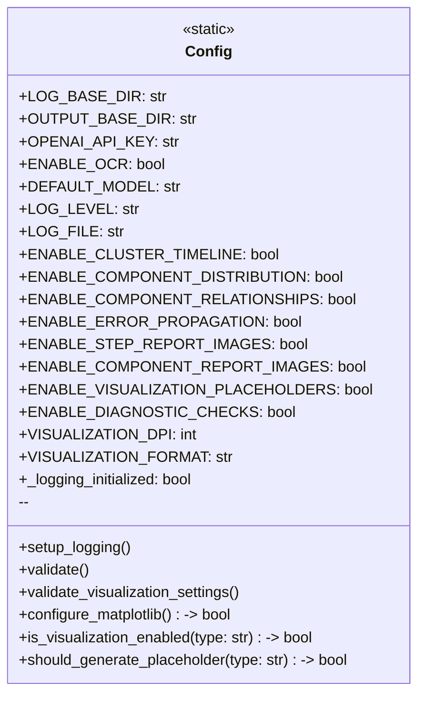
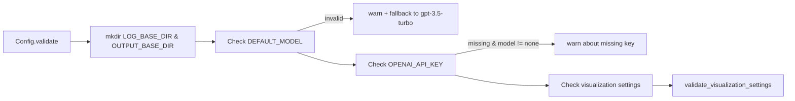
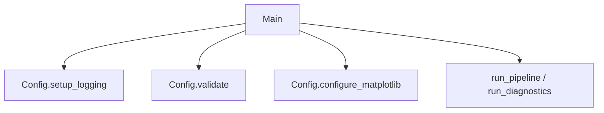

# Orbit Analyzer: Configuration & Environment Reference

## Overview

The Orbit Analyzer system employs a robust configuration and environment architecture to ensure consistent behavior across environments, proper UTF-8 logging, secure secret management, and controlled feature toggles. This document provides a comprehensive guide to the configuration subsystem with recommended practices for development and deployment.

## 1. Environment Variables & Defaults

All settings are primarily sourced from environment variables, with sensible defaults provided when variables are not explicitly set. The lookup order follows a multi-layered approach for security and flexibility:

```mermaid
flowchart LR
    subgraph Lookup Order
      A[ENV var] -->|set| Z[Use value]
      A -->|unset| B[dotenv.load_dotenv()]
      B --> C[ENV var again]
      C -->|set| Z
      C -->|unset| D[keyring.get_password]
      D -->|set| Z
      D -->|unset| E[WARN + use default/empty]
    end
```

### Core Environment Variables

| Variable | Type | Default | Description |
|----------|------|---------|-------------|
| `LOG_BASE_DIR` | str | `"./logs"` | Base directory for input log files |
| `OUTPUT_BASE_DIR` | str | `"./output"` | Base directory for all generated reports & assets |
| `OPENAI_API_KEY` | str | `""` | API key for GPT integration (retrieved via `secure_api_key.py`) |
| `ENABLE_OCR` | bool | `True` | Toggle for image-to-text OCR processing |
| `DEFAULT_MODEL` | str | `"gpt-3.5-turbo"` | LLM model selection (validated in `Config.validate()`) |
| `LOG_LEVEL` | str | `"INFO"` | Logging verbosity level for console & file output |
| `LOG_FILE` | str | `"orbit_analyzer.log"` | Path for the application log file |
| `PYTHONIOENCODING` | str | `"utf-8"` | Set automatically by `Config.setup_logging()` |
| `VISUALIZATION_DPI` | int | `100` | Resolution for generated charts & diagrams |
| `VISUALIZATION_FORMAT` | str | `"png"` | Default image format for visualizations |

### Feature Flag Environment Variables

| Feature Flag | Type | Default | Description |
|--------------|------|---------|-------------|
| `ENABLE_CLUSTER_TIMELINE` | bool | `False` | Toggle for step-timeline diagrams |
| `ENABLE_COMPONENT_DISTRIBUTION` | bool | `True` | Toggle for component error distribution charts |
| `ENABLE_COMPONENT_RELATIONSHIPS` | bool | `True` | Toggle for component relationship diagrams |
| `ENABLE_ERROR_PROPAGATION` | bool | `False` | Toggle for error propagation graphs |
| `ENABLE_STEP_REPORT_IMAGES` | bool | `False` | Toggle for step report visualizations |
| `ENABLE_COMPONENT_REPORT_IMAGES` | bool | `True` | Toggle for component report visualizations |
| `ENABLE_VISUALIZATION_PLACEHOLDERS` | bool | `False` | Toggle for placeholder generation when visualization fails |
| `ENABLE_DIAGNOSTIC_CHECKS` | bool | `False` | Toggle for pre-flight diagnostics before report generation |

To enable placeholder images when visualizations fail or data is missing, set the environment variable `ENABLE_VISUALIZATION_PLACEHOLDERS` to `True` before running the application.

## 2. Config Class Architecture

All settings are centralized in the `Config` class within `config.py`, implemented as static attributes for global access:



### Static Attribute Assignment

On module import, each attribute is initialized via `os.getenv(var_name, default_value)`. Boolean values undergo string-to-bool conversion with checks for `"true"`, `"1"`, and `"yes"` (case-insensitive).

### Key Methods

#### `setup_logging()`

Ensures proper UTF-8 logging with no duplicate handlers:

```mermaid
flowchart TD
    Start -->|First call| S[Config.setup_logging()]
    S --> A[Set PYTHONIOENCODING=utf-8]
    A --> Clear[Remove existing handlers]
    Clear --> FileH[Add UTF-8 FileHandler]
    FileH --> ConsoleH[Add UTF-8 console handler]
    ConsoleH --> End[Set _logging_initialized=True]
    Start -->|Subsequent calls| Skip[Return immediately]
```

Key implementation details:
- **Idempotent operation**: Checks `_logging_initialized` to prevent duplicate configuration
- **UTF-8 enforcement**: Sets `PYTHONIOENCODING=utf-8` in the environment
- **Handler management**: Clears any existing handlers before adding new ones
- **File logging**: Creates a UTF-8 encoded `FileHandler` pointed at `LOG_FILE`
- **Console logging**: Uses custom `UTF8LoggingHandler` for consistent encoding

#### `validate()`

Performs startup validation and auto-corrections:



Key implementation details:
- **Directory creation**: Ensures required log and output directories exist
- **Model validation**: Restricts `DEFAULT_MODEL` to whitelist (`gpt-4`, `gpt-3.5-turbo`, `none`)
- **API key warning**: Issues warning if key is missing but model requires it
- **Visualization validation**: Calls `validate_visualization_settings()`

#### `validate_visualization_settings()`

Ensures visualization settings are within valid ranges:

```mermaid
flowchart LR
    V["validate_visualization_settings"] --> DPI[Check DPI in 50-300]
    DPI -->|OK| FMT[Check FORMAT ∈ {png,svg,jpg}]
    DPI -->|Bad| ResetDPI[Warn + DPI=100]
    FMT -->|OK| End
    FMT -->|Bad| ResetFMT[Warn + FORMAT=png]
    ResetDPI --> FMT
    ResetFMT --> End
```

Key implementation details:
- **DPI bounds**: Limits `VISUALIZATION_DPI` to the range 50-300
- **Format validation**: Ensures `VISUALIZATION_FORMAT` is a recognized image format
- **Auto-correction**: Issues warnings and resets to defaults when values are out of range

#### `configure_matplotlib()`

Sets up thread-safe, headless plotting defaults:

```mermaid
flowchart TB
    Config.configure_matplotlib -->|try| ImportMatplotlib[Import matplotlib]
    ImportMatplotlib --> UseAgg[matplotlib.use('Agg', force=True)]
    UseAgg --> PyplotConfig[Configure rcParams]
    PyplotConfig --> InfoLog["Log: Matplotlib configured"]
    PyplotConfig --> Return[Return True]
    Config.configure_matplotlib -->|except| ErrorLog["Log: Configuration failed"]
    ErrorLog --> ReturnFalse[Return False]
```

Key implementation details:
- **Agg backend**: Forces the non-interactive Agg backend for thread safety
- **Global settings**: Configures defaults for DPI, font sizes, grid appearance
- **Error handling**: Catches and logs exceptions, returns False on failure

## 3. Secure API Key Retrieval

API key retrieval is centralized in `secure_api_key.py` with a multi-layered approach:

```mermaid
flowchart LR
    Start --> ENV[os.environ["OPENAI_API_KEY"]]
    ENV -->|set| Done
    ENV -->|unset| DotEnv[dotenv.load_dotenv()]
    DotEnv --> ENV2[os.environ["OPENAI_API_KEY"]]
    ENV2 -->|set| Done
    ENV2 -->|unset| Keyring[keyring.get_password()]
    Keyring -->|set| Done
    Keyring -->|unset| Warn["Log warning + return empty string"]
    Done --> Return["Return api_key"]
```

Key implementation details:
- **Multi-source lookup**: Checks environment, `.env` file, then system keyring
- **Graceful degradation**: Returns empty string with warning when key is unavailable
- **No hard failures**: Logs issue but allows operation to continue in offline mode

## 4. JSON Utilities

The system includes specialized JSON utilities in `json_utils.py` that preserve component metadata during serialization:

```mermaid
flowchart LR
    Data --> serialize_with_component_awareness
    serialize_with_component_awareness -->|writes| file_obj
    file_obj --> parse_with_component_awareness[json.load / json.loads]
    Data --> serialize_to_json_file
    serialize_to_json_file -->|mkdir| write_file[Write file (utf-8)]
    write_file --> verify[Verify round-trip]
```

Key functions:
- **`serialize_with_component_awareness(data, file_obj, primary_issue_component, indent)`**
- **`serialize_to_json_file(data, file_path, primary_issue_component, indent)`**
- **`parse_with_component_awareness(...)`**

All implementations use `ComponentAwareEncoder` to preserve component information through the serialization process.

## 5. Controller Startup Sequence

The main application entry point in `controller.py` executes a specific initialization sequence:



This sequence ensures that all environment variables are validated, logging is properly configured, and visualization settings are ready before any pipeline operations begin.

## 6. Thread-Safe Feature Flag Access

For thread safety in multi-threaded environments (particularly for visualizations), a thread-local implementation is provided:

```python
import threading
_visualization_local = threading.local()

def _is_feature_enabled(feature_name, default=False):
    # Use thread-local cache if available
    if not hasattr(_visualization_local, 'feature_cache'):
        _visualization_local.feature_cache = {}
    
    # Check cache first
    if feature_name in _visualization_local.feature_cache:
        return _visualization_local.feature_cache[feature_name]
    
    # Get from config
    from config import Config
    result = getattr(Config, feature_name, default)
    
    # Cache for future use
    _visualization_local.feature_cache[feature_name] = result
    
    return result
```

This pattern prevents race conditions and configuration inconsistencies in concurrent operations.

## Best Practices

### Development

1. **Use `.env` files**: Create a `.env` file in your project root with your development settings
2. **Enable diagnostics**: Set `ENABLE_DIAGNOSTIC_CHECKS=True` during development
3. **Configure logging**: Use `LOG_LEVEL=DEBUG` for detailed logs during development

### Deployment

1. **Environment variables**: Set critical variables via environment or secret management
2. **API key security**: Use environment variables or keyring for sensitive credentials
3. **Directory configuration**: Configure `LOG_BASE_DIR` and `OUTPUT_BASE_DIR` to appropriate paths
4. **Feature toggles**: Disable optional features in resource-constrained environments

### Testing

1. **Mock Config**: Override Config attributes for targeted testing
2. **Reset state**: Reset `Config._logging_initialized = False` between test cases
3. **Environment isolation**: Use a test-specific `.env` file or environment variables

## References

- Configuration module: `config.py`
- Secure API key management: `secure_api_key.py`
- JSON utilities: `json_utils.py`
- Controller entry point: `controller.py`
- UTF-8 logging: `UTF8LoggingHandler` in `config.py`
