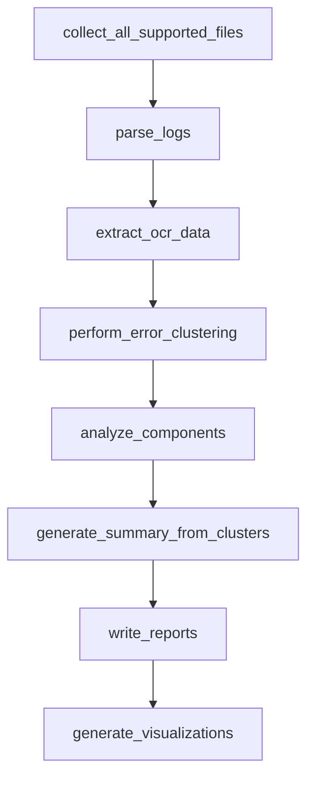
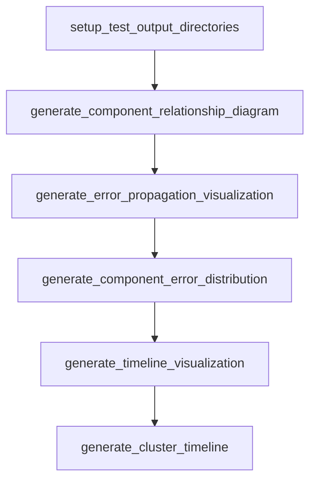
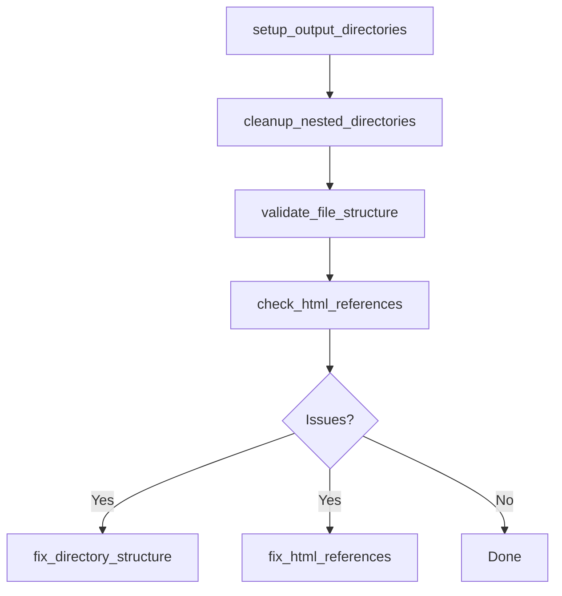
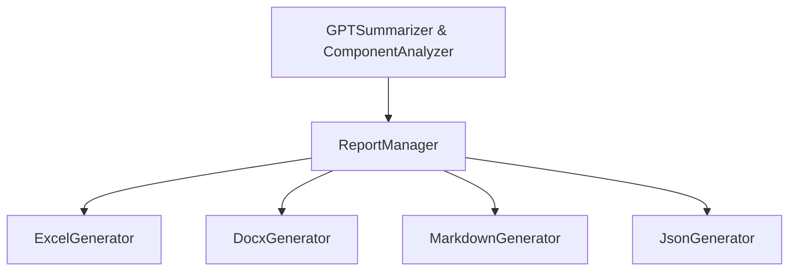
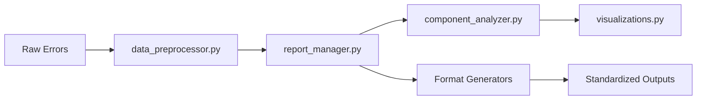
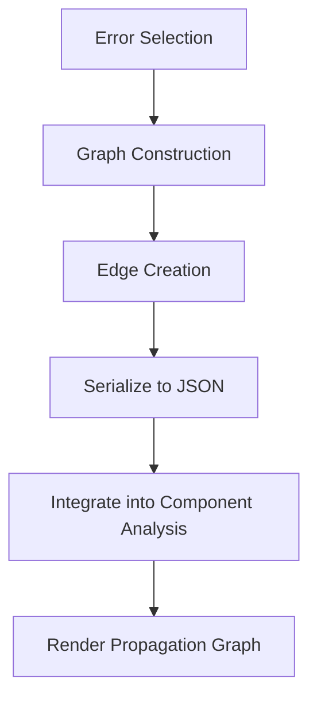

# Orbit Analyzer System - Pipeline Architecture
*Reference Document for Development Teams*

## Overview
This document provides a comprehensive reference for all major pipelines and data flows in the Orbit Analyzer system. Use this for development, maintenance, and understanding the system architecture.

## Table of Contents
1. [Main Analysis Pipeline](#1-main-analysis-pipeline)
2. [Log Analysis Pipeline](#2-log-analysis-pipeline)
3. [Report Generation Pipeline](#3-report-generation-pipeline)
4. [Visualization Generation Pipeline](#4-visualization-generation-pipeline)
5. [Component Verification Flow](#5-component-verification-flow)
6. [Directory Structure Validation Flow](#6-directory-structure-validation-flow)
7. [Data Flow Patterns](#7-data-flow-patterns)
8. [High-Level Architecture Flows](#8-high-level-architecture-flows)
9. [Error Propagation Analysis Flow](#9-error-propagation-analysis-flow)

---

## 1. Main Analysis Pipeline
*Orchestrated by controller.py, end-to-end from logs to multi-format reports.*


### Pipeline Steps
1. **Configuration & Directory Setup**
   - Normalize test_id and provision directories via `setup_output_directories`
   - Creates standardized directory structure

2. **Log & Image Collection**
   - Discover supported log and image files (`collect_all_supported_files`)
   - Handles different file types and formats

3. **Error Extraction**
   - Parse logs to extract error entries (`parse_logs`)
   - Applies initial filtering and extraction logic

4. **OCR Processing** *(optional)*
   - If enabled, run OCR on images to capture text (`extract_ocr_data`)
   - Extracts text from screenshots for additional context

5. **Component Identification**
   - Map errors to components and produce a primary issue component
   - Uses `assign_components_and_relationships` to determine responsible components

6. **Error Clustering**
   - Group similar errors into clusters (`perform_error_clustering`)
   - Reduces redundancy and organizes issues by similarity

7. **Component Integration** *(optional)*
   - Use external schema to enrich component analysis (`ComponentIntegration.analyze_logs`)
   - Adds additional component relationship data when available

8. **Gherkin Correlation** *(optional)*
   - Correlate logs with feature-file steps (`run_gherkin_correlation`)
   - Maps errors to BDD test steps

9. **Summary Generation**
   - Generate AI-powered summary from clusters, OCR, and component data
   - Uses `generate_summary_from_clusters` for intelligent analysis

10. **Report Generation**
    - Invoke `write_reports` to produce multi-format outputs
    - Generates Excel, DOCX, HTML, JSON, Markdown reports

### Key Considerations
- The pipeline handles both required and optional steps gracefully
- Component information is preserved throughout the entire flow
- Directory structure is maintained consistently for all outputs

---

## 2. Log Analysis Pipeline
*Focused extraction and clustering of errors from logs/images.*



### Pipeline Steps
1. **Log Collection** (`collect_all_supported_files`)
   - Gathers all relevant log and image files from specified directories

2. **Log Parsing** (`parse_logs`)
   - Extracts structured error information from raw logs

3. **OCR Processing** (`extract_ocr_data`)
   - Processes images to extract text content

4. **Error Clustering** (`perform_error_clustering`)
   - Groups similar errors to reduce redundancy

5. **Component Analysis** (`analyze_components`)
   - Determines component attribution for errors

6. **Summary Generation** (`generate_summary_from_clusters`)
   - Creates AI-driven analysis of error patterns

7. **Report Generation** (`write_reports`)
   - Produces formatted reports across multiple output types

8. **Visualization Generation** (`generate_visualizations`)
   - Creates graphical representations of analysis results

### Implementation Notes
- This pipeline is often used in testing or focused analysis scenarios
- Emphasizes error extraction and clustering processes
- Can be run independently for log-only analysis

---

## 3. Report Generation Pipeline
*Transforms prepared data into Excel, DOCX, HTML, JSON, and Markdown.*

```mermaid
flowchart LR
    A[setup_test_output_directories] --> B[prepare_report_data]
    B --> C[generate_excel_report]
    C --> D[generate_docx_report]
    D --> E[generate_component_report (HTML)]
    E --> F[save_json_data]
```

### Pipeline Steps
1. **Directory Setup** (`setup_test_output_directories`)
   - Creates the standardized directory structure for outputs
   - Prevents nested directory issues

2. **Data Preparation** (`prepare_report_data`)
   - Normalizes and structures analysis data for reporting
   - Ensures component information consistency

3. **Excel Report Generation** (`generate_excel_report`)
   - Creates multi-sheet Excel reports with formatting
   - Includes summary, errors, clusters, and component data

4. **DOCX Report Generation** (`generate_docx_report`)
   - Produces Word documents formatted for bug submission
   - Emphasizes readability and structured content

5. **HTML Component Report** (`generate_component_report`)
   - Creates interactive HTML reports with visualizations
   - Focuses on component relationships and error patterns

6. **JSON Data Storage** (`save_json_data`)
   - Stores complete analysis data in structured JSON
   - Preserves all component information and relationships

### Critical Considerations
- Reports must maintain component information throughout generation
- Directory structure must follow standardized patterns
- Visual elements must be properly referenced in HTML reports

---

## 4. Visualization Generation Pipeline
*Produces charts and diagrams for component/error insights.*



### Pipeline Steps
1. **Directory Setup** (`setup_test_output_directories`)
   - Creates standardized directories for visualization outputs
   
2. **Component Relationships** (`generate_component_relationship_diagram`)
   - Visualizes connections between system components
   - Highlights primary issue components

3. **Error Propagation** (`generate_error_propagation_visualization`)
   - Shows how errors propagate between components
   - Visualizes error flow paths

4. **Component Distribution** (`generate_component_error_distribution`)
   - Displays error counts across components
   - Helps identify problematic components

5. **Timeline Visualization** (`generate_timeline_visualization`)
   - Shows errors across time and test steps
   - Provides temporal analysis

6. **Cluster Timeline** (`generate_cluster_timeline`)
   - Combines clustering with timeline visualization
   - Shows patterns of errors over time

### Thread Safety and Performance
- All visualization generation is thread-safe
- Uses non-interactive matplotlib 'Agg' backend
- Implements timeout protection for long-running visualizations
- Provides fallback placeholder generation for failures
- Ensures proper resource cleanup to prevent memory leaks

---

## 5. Component Verification Flow
*Tracks and verifies that component metadata persists through transformations.*


### Pipeline Steps
1. **Pre-processing Snapshot** (`trace_component_changes`)
   - Captures component information before processing
   - Records original state for comparison

2. **Data Transformation**
   - Applies changes to data structure
   - Example operations include processing, clustering, or serialization

3. **Post-processing Snapshot** (`trace_component_changes`)
   - Captures component information after processing
   - Records new state for comparison

4. **Change Detection** (`audit_component_changes`)
   - Compares before and after states
   - Identifies any changes to component information

5. **Preservation Verification** (`verify_component_preservation`)
   - Ensures critical component fields are preserved
   - Flags any lost or modified component data

6. **Diagnostic Generation** (`generate_component_diagnostic`)
   - Creates detailed diagnostics about component information
   - Helps troubleshoot any information loss issues

### Critical Implementation Notes
- Component information must be preserved during all operations
- Special care needed during serialization/deserialization
- The `ComponentAwareEncoder` must be used for JSON operations
- The system differentiates between "unknown" fields being populated (enhancement) versus specific values being lost (problem)

---

## 6. Directory Structure Validation Flow
*Checks and repairs output directory integrity and HTML refs.*



### Pipeline Steps
1. **Setup Standard Directories** (`setup_output_directories`)
   - Creates the expected directory structure
   - Sets up main directory and subdirectories

2. **Cleanup Nested Directories** (`cleanup_nested_directories`)
   - Identifies and resolves any nested directory issues
   - Prevents directory structure problems

3. **Validate Structure** (`validate_file_structure`)
   - Checks if files are in their proper locations
   - Identifies misplaced files

4. **HTML Reference Checking** (`check_html_references`)
   - Verifies HTML references to supporting files
   - Ensures visualization links are correct

5. **Fix Structure Issues** (`fix_directory_structure`)
   - Corrects any directory structure problems found
   - Moves misplaced files to proper locations

6. **Correct HTML References** (`fix_html_references`)
   - Fixes references to files in HTML reports
   - Updates paths to ensure correct visualization display

### Directory Structure Standards
- Primary reports go in the base directory
- JSON data goes in the `json/` subdirectory
- Visualizations go in the `supporting_images/` subdirectory
- Debug information goes in the `debug/` subdirectory
- File naming follows the pattern: `{test_id}_{file_type}.{extension}`

---

## 7. Data Flow Patterns

### 7.1 Log Analysis Flow


### 7.2 Component Analysis Flow


### 7.3 Report Generation Flow


### 7.4 Path Sanitization Flow


### Key Data Flow Principles
- Data flows through modules in a structured, predictable manner
- Component information is preserved at each stage
- File paths are sanitized and standardized consistently
- Report generation is handled by specialized generators for each format
- Path validation occurs at critical junctures

---

## 8. High-Level Architecture Flows

### 8.1 Report Generation Process
```mermaid
flowchart TD
    P[Data Preparation] --> O[Orchestration (ReportManager)]
    O --> C[Component Analysis]
    C --> V[Visualization Generation]
    V --> F[Format-Specific Generators]
    F --> PV[Path Verification]
```

#### Process Steps
1. **Data Preparation**
   - Normalize and enhance error/cluster data
   - Functions: `preprocess_errors`, `preprocess_clusters`

2. **Orchestration**
   - ReportManager drives multi-format generation
   - Functions: `generate_reports`, `_enhance_component_analysis`

3. **Component Analysis**
   - Build and embed component relationships
   - Functions: `build_component_analysis`, `generate_component_report`

4. **Visualization Generation**
   - Thread-safe image creation with fallbacks
   - Functions: `generate_timeline_image`, `generate_component_visualization`

5. **Format-Specific Generation**
   - Invoke each generator module
   - Modules: `excel_generator`, `json_generator`, `docx_generator`, `markdown_generator`

6. **Path Verification**
   - Ensure outputs adhere to directory standards
   - Function: `fix_directory_structure`

### 8.2 DataFlow for Report Subsystem


#### Data Flow Description
- **Raw Errors** → **data_preprocessor.py**: Normalization and component tagging
- **data_preprocessor.py** → **report_manager.py**: Central orchestration
- **report_manager.py** → **component_analyzer.py**: Relationship analysis
- **component_analyzer.py** → **visualizations.py**: Diagram creation
- **report_manager.py** → **Format-specific generators** → **Standardized output files**

---

## 9. Error Propagation Analysis Flow
*Visualizes causal relationships between errors.*



### Flow Steps
1. **Error Selection**
   - Choose errors for propagation analysis
   - Focus on errors with component attribution

2. **Graph Construction**
   - Build directed graph structure
   - Nodes represent errors or components

3. **Edge Creation**
   - Establish relationships between nodes
   - Define propagation paths

4. **Serialize to JSON**
   - Convert graph to serializable format
   - Preserve component relationships

5. **Integrate into Component Analysis**
   - Combine with broader component analysis
   - Enhance component relationship data

6. **Render Propagation Graph**
   - Generate visual representation
   - Show flow of errors between components

### Key Features
- Shows how errors propagate across component boundaries
- Helps identify root cause components
- Visualizes error relationships graphically
- Uses networkx for graph operations and layout
- Supports interactive exploration in HTML reports

---

## Critical Mechanisms and Warnings

### Component Information Preservation
- ⚠️ **CRITICAL**: Component information must be preserved throughout all processing
- Always use `ComponentAwareEncoder` for JSON serialization
- Use `trace_component_changes` to track component information changes
- Verify component preservation after all operations with `verify_component_preservation`

### Directory Structure Management
- ⚠️ **CRITICAL**: Follow standardized directory structure patterns
- Always use `sanitize_base_directory` to prevent nested directories
- Use `get_output_path` with appropriate `OutputType` for all file operations
- Run `fix_directory_structure` after report generation

### Visualization Thread Safety
- ⚠️ **CRITICAL**: Use thread-safe visualization practices
- Configure matplotlib with 'Agg' backend for headless operation
- Always use `_save_figure_with_cleanup` to prevent memory leaks
- Implement timeout protection for long-running visualizations
- Provide fallback placeholders for visualization failures

### Path Handling
- ⚠️ **CRITICAL**: Use standardized path handling
- Always use `get_standardized_filename` for consistent file naming
- Use `get_path_reference` for HTML references to supporting files
- Normalize test IDs with `normalize_test_id`
