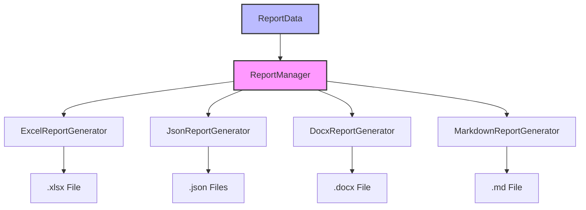
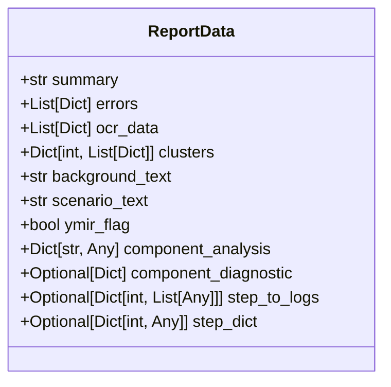
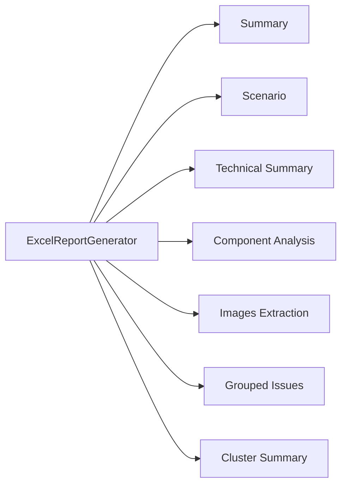
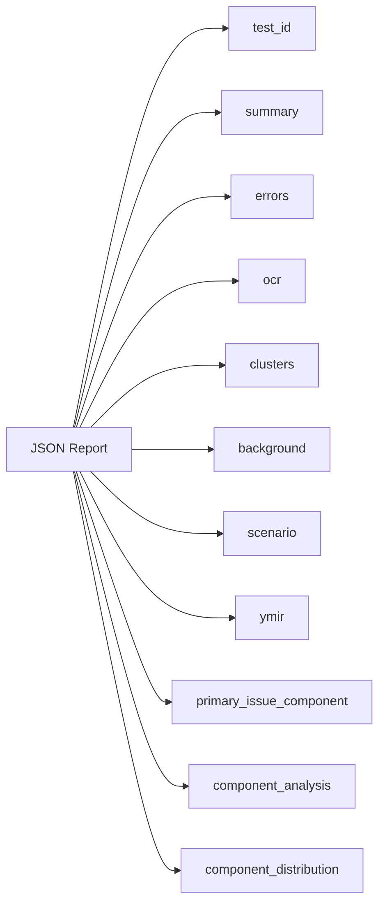
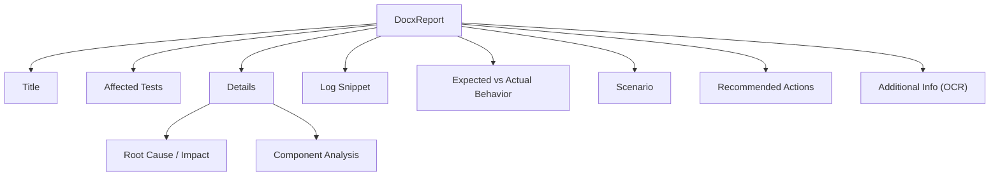
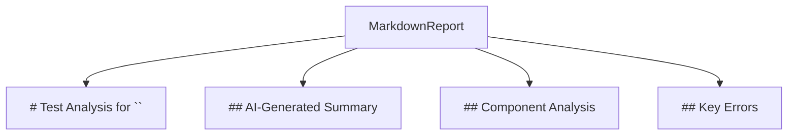
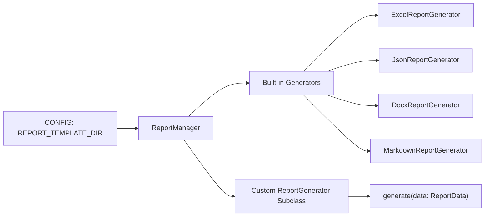

# Orbit Analyzer: Report Data Schemas & Integration Guide

## Overview

This document provides the definitive reference for the Orbit Analyzer's report generation system, including data schemas, output formats, and integration points. It serves as both a developer guide and architectural documentation for implementing, extending, or consuming the report generation subsystem.



## 1. Input Data Model: ReportData

All report generators consume a standardized `ReportData` object, which contains all analysis results required to generate comprehensive reports.



### ReportData Fields

| Field | Type | Description |
|-------|------|-------------|
| `summary` | str | AI-generated high-level test summary |
| `errors` | List[Dict] | List of error objects (each with text, timestamp, file, line_num, severity, component, etc.) |
| `ocr_data` | List[Dict] | OCR extractions from screenshots (file, text) |
| `clusters` | Dict[int, List[Dict]] | Error clusters keyed by cluster ID |
| `background_text` | str | Gherkin "Background" section (if Ymir test) |
| `scenario_text` | str | Gherkin "Scenario" section (if Ymir test) |
| `ymir_flag` | bool | Whether this run is a Ymir (BDD) flow |
| `component_analysis` | Dict[str, Any] | Full component-analysis output (summary, relationships, graphs, metrics) |
| `component_diagnostic` | Optional[Dict] | Diagnostic hints for mapping unknown components |
| `step_to_logs` | Optional[Dict[int, List[Any]]] | (Visualization only) Mapping from step # → log entries |
| `step_dict` | Optional[Dict[int, Any]] | (Visualization only) Step metadata (text, timestamps) |

## 2. Report Formats & Content

### Excel Report (ExcelReportGenerator)

The Excel report serves as the most comprehensive output with multiple sheets that organize the test data in different views.



#### Excel Sheets

| Sheet Name | Key Columns / Sections |
|------------|------------------------|
| Summary | Test ID, AI-Generated Analysis |
| Scenario (Ymir) | Test ID, Background, Test Scenario |
| Technical Summary | Test ID, Concatenated top errors |
| Component Analysis | Total Components, Components w/ Errors, Identified Root Cause, Propagation Diagram, Heatmap |
| Images Extraction | File Name, Extracted Text |
| Grouped Issues | Test ID, Cluster ID, Sequence, Timestamp, Severity, Component, File, Line, Error Message |
| Cluster Summary | Cluster ID, Error Count, Severity Breakdown, Primary Component, Time Span, Representative Error |

### JSON Report (JsonReportGenerator)

The JSON report provides a machine-readable representation of all analysis data, preserving component information through specialized serialization.



#### JSON Schema

```json
{
  "test_id": "SXM-1234",
  "summary": "...",
  "errors": [ /* full error dicts */ ],
  "ocr": [ { "file": "...", "text": "..." } ],
  "clusters": { "0": [ /* errors */ ], "1": [ /* ... */ ] },
  "background": "...",
  "scenario": "...",
  "ymir": true,
  "primary_issue_component": "soa",
  "component_analysis": { /* detailed analysis */ },
  "component_distribution": { "soa": 12, "mimosa": 4, /* ... */ }
}
```

### DOCX Report (DocxReportGenerator)

The DOCX report is formatted for Jira bug submission with a structured layout that presents the most important information for issue resolution.



#### DOCX Layout

1. **Title**: "Bug Report for \<Test ID\>"
2. **Affected Tests** (with high-severity count)
3. **Details**
   - Root Cause & Impact (parsed from summary)
   - Component Analysis (if provided)
     - Root-cause component and description
     - Affected components list
     - Error propagation path
4. **Log Snippet** (top representative errors)
5. **Expected vs. Actual Behavior**
6. **Scenario** (from Gherkin)
7. **Recommended Actions** (parsed from summary)
8. **Additional Information** (OCR)

### Markdown Report (MarkdownReportGenerator)

The Markdown report provides a simple, text-based summary suitable for quick review or for environments without specialized viewers.



#### Markdown Format

```markdown
# Test Analysis for SXM-1234

## AI-Generated Summary
...

## Component Analysis
* Analyzed 150 log entries  
* Found 20 errors across components  
* Primary issue component: SOA  

See detailed [Component Analysis Report](component_report.html)

## Key Errors
1. **app_debug.log** [Component: SOA]: Error message...
2. ...
```

## 3. Architecture & Integration

### ReportGenerator Interface

All report generators implement a common interface to ensure consistent behavior and extensibility:

```mermaid
flowchart LR
    RG[ReportGenerator Interface] --> gen["generate(data: ReportData) -> str"]
    RG <|-- ExcelReportGenerator
    RG <|-- JsonReportGenerator
    RG <|-- DocxReportGenerator
    RG <|-- MarkdownReportGenerator
```

```python
class ReportGenerator:
    def __init__(self, config: ReportConfig):
        self.config = config
        
    def generate(self, data: ReportData) -> str:
        """Produce the report and return its file path."""
        raise NotImplementedError("Subclasses must implement this method")
```

### Fallback Behaviors

Each generator implements robust fallbacks to ensure the system continues to function even when optional dependencies are unavailable:

- **Excel:** Skips generation if openpyxl is missing or if the file is locked by another process
- **DOCX:** Falls back to plain text if python-docx is unavailable
- **JSON:** Uses ComponentAwareEncoder to preserve component metadata
- **Markdown:** Always emits basic structure (minimal dependencies)

### Extension Points



#### Adding a New Report Format

1. Create a subclass of `ReportGenerator` in reports/ (e.g., `HtmlStepReportGenerator`)
2. Implement `generate(self, data: ReportData) -> str`
3. Register it in `ReportManager.__init__` under a new flag
4. Update the `ReportConfig` class to include your new flag

#### Template Overrides

The report templates can be externalized for customization:

1. Create Jinja2 templates for any report format
2. Set `REPORT_TEMPLATE_DIR` to point to your template directory
3. The `ReportManager` will load templates from this directory instead of using hard-coded strings

## 4. Directory Structure & File Naming

### Output Directory Structure

```
output/
└── SXM-12345/
    ├── SXM-12345_log_analysis.xlsx       # Excel report
    ├── SXM-12345_bug_report.docx         # DOCX report
    ├── SXM-12345_log_analysis.md         # Markdown report
    ├── SXM-12345_component_report.html   # Component HTML report
    ├── json/
    │   ├── SXM-12345_log_analysis.json   # Main JSON report
    │   └── SXM-12345_component_analysis.json  # Component analysis
    └── supporting_images/
        ├── SXM-12345_component_errors.png     # Component visualization
        ├── SXM-12345_component_relationships.png  # Relationship diagram
        ├── SXM-12345_timeline.png             # Timeline visualization
        └── SXM-12345_cluster_timeline.png     # Cluster timeline
```

### File Naming Convention

All files follow the pattern: `{test_id}_{file_type}.{extension}`

## 5. Component Preservation Mechanism

A critical feature of the report generation system is preserving component information throughout the processing pipeline. This is primarily handled through the `ComponentAwareEncoder` in JsonReportGenerator:

```python
# Use ComponentAwareEncoder for JSON serialization
json.dump(data, file, 
         cls=lambda *a, **kw: ComponentAwareEncoder(primary_issue_component="soa"),
         indent=2)
```

### Critical Component Fields

The system tracks and preserves these component-related fields:

- `component` - The identified component
- `component_source` - How the component was identified
- `source_component` - Original component before processing
- `root_cause_component` - Component identified as root cause
- `primary_issue_component` - Primary component for reporting
- `affected_components` - Related components affected

## 6. Usage Examples

### Basic Report Generation

```python
from reports import write_reports

# Generate all reports with default settings
results = write_reports(
    output_dir="output/SXM-123456",
    test_id="SXM-123456",
    summary="Test failure analysis...",
    errors=errors,
    ocr_data=ocr_data,
    clusters=error_clusters
)
```

### Advanced Configuration

```python
from reports.report_manager import ReportManager
from reports.base import ReportConfig, ReportData

# Create configuration with specific options
config = ReportConfig(
    output_dir="output/SXM-123456",
    test_id="SXM-123456",
    enable_excel=True,
    enable_json=True,
    enable_docx=False,
    enable_component_report=True
)

# Create data container
data = ReportData(
    errors=errors,
    summary=summary,
    clusters=clusters,
    ocr_data=ocr_data
)

# Generate reports
manager = ReportManager(config)
results = manager.generate_reports(data)
```

---

This document serves as the comprehensive reference for Orbit Analyzer's report generation system. By following these schemas and contracts, any consumer or new generator will know exactly what data to expect, how to plug in, and where to handle missing features.
