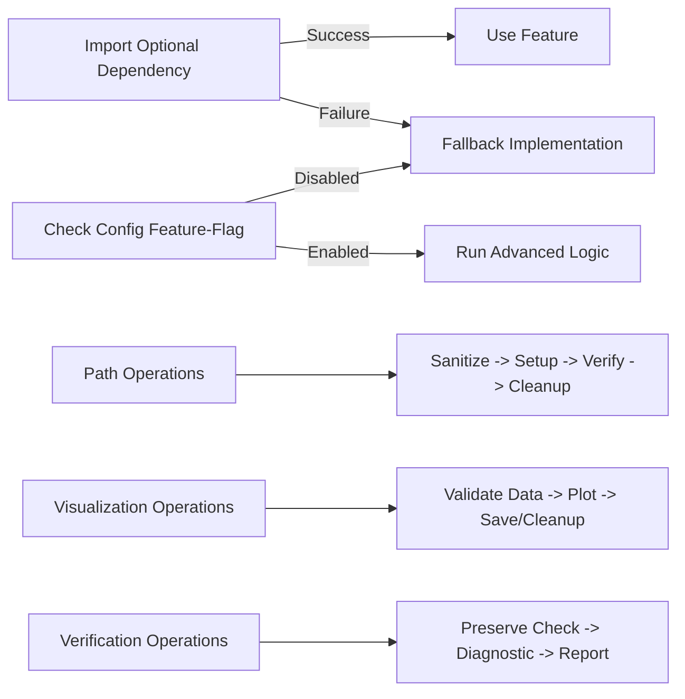

# Orbit Analyzer: Utility Modules & Common Behaviors

This reference guide provides a comprehensive overview of the core utility modules in the Orbit Analyzer system, detailing their public interfaces, key behaviors, and common patterns. Each module is presented with function tables and flow diagrams to illustrate their structure and relationships.

## Table of Contents

1. [Path Utilities (path_utils.py)](#1-path-utilities-path_utilspy)
2. [Path Validation (path_validator.py)](#2-path-validation-path_validatorpy)
3. [Visualization Utilities (visualization_utils.py)](#3-visualization-utilities-visualization_utilspy)
4. [Component Verification (component_verification.py)](#4-component-verification-component_verificationpy)
5. [Common Patterns & Behaviors](#5-common-patterns--behaviors)
6. [Package Initialization (utils/__init__.py)](#6-package-initialization-utils__init__py)

---

## 1. Path Utilities (path_utils.py)

Centralized path-handling functions to enforce a consistent directory structure and naming conventions throughout the system.

### Core Enum Definition

```python
from enum import Enum

class OutputType(Enum):
    PRIMARY_REPORT = "primary"  # Goes in root directory (Excel, DOCX, HTML)
    JSON_DATA      = "json"     # Goes in json/ subdirectory
    VISUALIZATION  = "image"    # Goes in supporting_images/ subdirectory
    DEBUGGING      = "debug"    # Goes in debug/ subdirectory (optional)
```

### Function Reference

| Function | Signature | Description |
|----------|-----------|-------------|
| `normalize_test_id` | `normalize_test_id(test_id: str) -> str` | Normalizes to SXM-#### format |
| `sanitize_base_directory` | `sanitize_base_directory(base_dir: str, expected_subdir: str=None) -> str` | Prevents nested subdirectories like json/json or supporting_images/supporting_images |
| `get_output_path` | `get_output_path(base_dir: str, test_id: str, filename: str, output_type: OutputType, create_dirs: bool=True) -> str` | Returns a fully-qualified path (and creates dirs) based on output_type |
| `setup_output_directories` | `setup_output_directories(base_dir: str, test_id: str) -> Dict[str,str]` | Creates {base,json,supporting_images,debug} under base_dir |
| `get_standardized_filename` | `get_standardized_filename(test_id: str, file_type: str, extension: str) -> str` | Prefixes filenames with normalized test ID |
| `get_visualization_path` | `get_visualization_path(output_dir: str, test_id: str, viz_type: str, extension: str="png") -> str` | Convenience wrapper for get_output_path(..., OutputType.VISUALIZATION) |
| `cleanup_nested_directories` | `cleanup_nested_directories(base_dir: str) -> Dict[str,int]` | Detects and flattens improperly nested {json,json}, {supporting_images,supporting_images}, {debug,debug} |
| `get_path_reference` | `get_path_reference(path: str, base_dir: str, reference_type: str="html") -> Optional[str]` | Converts a full path into an HTML- or JSON-friendly reference (e.g., supporting_images/foo.png) |
| `verify_visualization_directory` | `verify_visualization_directory(base_dir: str) -> bool` | Ensures supporting_images/ exists and is writable |
| `ensure_test_dirs` | `ensure_test_dirs(test_id: str) -> Dict[str,str]` | Creates both logs/{test_id} and output/{test_id}/{json,supporting_images,debug} per Config defaults |

### Flow Diagram

```mermaid
flowchart LR
    A[normalize_test_id(test_id)] --> B[sanitize_base_directory(base_dir)]
    B --> C[setup_output_directories(base_dir, test_id)]
    C --> D[get_output_path(..., OutputType)]
    D --> E[get_visualization_path(...)]
    B --> F[cleanup_nested_directories(base_dir)]
    E --> G[get_path_reference(...)]
    C --> H[ensure_test_dirs(test_id)]
```

---

## 2. Path Validation (path_validator.py)

Validates and repairs output directory structures and HTML references to maintain consistency.

### Function Reference

| Function | Signature | Description |
|----------|-----------|-------------|
| `validate_file_structure` | `validate_file_structure(base_dir: str, test_id: str) -> Dict[str,List[str]]` | Reports misplaced files (images in json/, json in supporting_images/), nested dirs, and missing expected files |
| `check_html_references` | `check_html_references(html_file: str) -> Dict[str,List[str]]` | Finds `` tags missing supporting_images/ prefix or pointing to non-existent files |
| `print_validation_results` | `print_validation_results(base_dir: str, test_id: str) -> None` | Human-readable summary of structure and HTML reference issues |
| `fix_directory_structure` | `fix_directory_structure(base_dir: str, test_id: str) -> Dict[str,List[str]]` | Moves misfiled images/JSON, flattens nested dirs, standardizes on component_errors.png vs. component_distribution.png |
| `fix_html_references` | `fix_html_references(html_path: str, base_dir: str) -> List[str]` | Updates `` src to use supporting_images/, replaces hidden containers, and corrects .png naming |

### Flow Diagram

```mermaid
flowchart TD
    A[validate_file_structure(base_dir, test_id)] --> B[print_validation_results(...)]
    A --> C[fix_directory_structure(base_dir, test_id)]
    D[check_html_references(html_file)] --> E[print_validation_results(...)]
    D --> F[fix_html_references(html_file, base_dir)]
```

---

## 3. Visualization Utilities (visualization_utils.py)

Shared routines for plotting, placeholders, and safe figure management with thread safety and fallbacks.

### Function Reference

| Function | Signature | Description |
|----------|-----------|-------------|
| `_is_feature_enabled` | `_is_feature_enabled(name: str, default: bool=False) -> bool` | Checks Config flags (e.g., ENABLE_VISUALIZATION_PLACEHOLDERS) |
| `_is_placeholder_enabled` | `_is_placeholder_enabled() -> bool` | Shortcut for placeholders |
| `verify_visualization_data` | `verify_visualization_data(data: Any, data_type: str) -> (bool,str)` | Validates data before plotting (clusters, relationships, etc.) |
| `handle_empty_data` | `handle_empty_data(output_dir: str, test_id: str, data_type: str, message: Optional[str]=None) -> Optional[str]` | Emits placeholder or skips if no data |
| `configure_matplotlib_backend` | `configure_matplotlib_backend() -> pyplot or None` | Forces Agg backend, sets DPI/font defaults |
| `save_figure_with_cleanup` | `save_figure_with_cleanup(fig, image_path: str, dpi: int=100) -> Optional[str]` | Ensures fig.savefig, verifies file size, always closes fig |
| `get_visualization_path` | `get_visualization_path(output_dir: str, test_id: str, viz_type: str, extension: str="png") -> str` | Delegates to path_utils.get_output_path or fallback logic |
| `verify_image_file` | `verify_image_file(image_path: str, description: str="visualization") -> bool` | Checks existence, size, and integrity (via PIL if available) |
| `generate_placeholder` | `generate_placeholder(output_dir: str, test_id: str, message: str) -> Optional[str]` | Renders a text-only figure when data is missing |
| `get_preferred_format` | `get_preferred_format(default_format: str="png") -> str` | Chooses svg if supported, else default |
| `calculate_figure_size` | `calculate_figure_size(graph_size: int) -> (float,float)` | Adapts figure dimensions to graph complexity |
| `setup_graph_visualization` | `setup_graph_visualization(graph_size: int) -> (fig, width_px, height_px)` | Returns sized figure for networkx plots |

### Flow Diagram

```mermaid
flowchart LR
    subgraph Plot Setup
      A[configure_matplotlib_backend()] --> B[calculate_figure_size(...)]
      B --> C[setup_graph_visualization(...)]
    end
    subgraph Data Validation
      D[verify_visualization_data(data)] -->|ok| E[proceed to save]
      D -->|empty| F[handle_empty_data(...)]
    end
    E --> G[save_figure_with_cleanup(fig, path)]
    F --> H[generate_placeholder(...)]
    G --> I[verify_image_file(path)]
```

---

## 4. Component Verification (component_verification.py)

Utilities to ensure component metadata remains consistent through data processing and serialization.

### Function Reference

| Function | Signature | Description |
|----------|-----------|-------------|
| `verify_component_preservation` | `verify_component_preservation(source: Any, target: Any, path: str="") -> bool` | Recursively checks dicts/lists for mismatches in COMPONENT_FIELDS |
| `verify_component_preservation_in_file` | `verify_component_preservation_in_file(src_path: str, tgt_path: str) -> bool` | Loads JSON files and delegates to verify_component_preservation |
| `verify_component_fields_in_list` | `verify_component_fields_in_list(src: List[Dict], tgt: List[Dict]) -> bool` | Applies list-wise preservation checks |
| `verify_component_fields_in_clusters` | `verify_component_fields_in_clusters(src: Dict[int,List[Dict]], tgt: Dict[int,List[Dict]]) -> bool` | Ensures each cluster retains component data |
| `count_component_fields` | `count_component_fields(data: Any) -> Dict[str,int]` | Tallies non-null occurrences of each component field |
| `generate_component_diagnostic` | `generate_component_diagnostic(file_path: str) -> Dict[str,Any]` | Builds a diagnostic summary, counting fields, error counts, grouping by component_source |
| `trace_component_changes` | `trace_component_changes(obj: Dict, before_op: str, after_op: str) -> Dict[str,Any]` | Snapshots component fields for before/after operations |
| `audit_component_changes` | `audit_component_changes(before: Dict, after: Dict) -> Dict[str,Any]` | Compares two snapshots to report actual changes |
| `component_info_summary` | `component_info_summary(data: Any) -> Dict[str,Any]` | Produces a high-level overview of field presence, consistency, and distribution |
| `export_diagnostic_report` | `export_diagnostic_report(data: Any, output_path: str, primary_issue_component: str="unknown") -> str` | Serializes a detailed JSON diagnostic report |

### Flow Diagram

```mermaid
flowchart LR
    A[verify_component_preservation(source, target)] --> B[True/False]
    A --> C[verify_component_preservation_in_file(src_path, tgt_path)]
    D[verify_component_fields_in_list(src, tgt)] --> E[True/False]
    F[verify_component_fields_in_clusters(src_clusters, tgt_clusters)] --> G[True/False]
    H[count_component_fields(data)] --> I[field counts]
    J[generate_component_diagnostic(file_path)] --> K[diagnostic dict]
    L[trace_component_changes(obj, before_op, after_op)] --> M[change snapshot]
    M --> N[audit_component_changes(before, after)]
    N --> O[change report]
    O --> P[export_diagnostic_report(data, output_path)]
```

---

## 5. Common Patterns & Behaviors

### Flow Diagram



### Import Fallbacks

Every utility module guards optional dependencies (e.g., reports.base, matplotlib, PIL, config) with try/except blocks, ensuring core logic still runs gracefully when dependencies are unavailable.

```python
try:
    import matplotlib
    matplotlib.use('Agg', force=True)
    import matplotlib.pyplot as plt
    HAS_MATPLOTLIB = True
except ImportError:
    HAS_MATPLOTLIB = False
    logging.warning("Matplotlib not available - visualization will use fallbacks")
```

### Feature-Flag Guards

Visualization placeholders and advanced behaviors toggle via Config flags checked by `_is_feature_enabled`.

```python
def _is_feature_enabled(feature_name, default=False):
    # Thread-safe feature flag checking with cache
    if not hasattr(_visualization_local, 'feature_cache'):
        _visualization_local.feature_cache = {}
    
    # Check cache first
    if feature_name in _visualization_local.feature_cache:
        return _visualization_local.feature_cache[feature_name]
    
    # Get from config with fallback
    try:
        from config import Config
        result = getattr(Config, feature_name, default)
    except ImportError:
        result = default
    
    # Cache for future use
    _visualization_local.feature_cache[feature_name] = result
    
    return result
```

### Directory Hygiene

- **Sanitization**: Prevent nested subdirs before any path computation
- **Cleanup**: Automated flattening of leftovers from previous runs
- **Validation & Fixes**: Detect and repair misplacements to maintain consumer-friendly structure

### Resource Management

- **Matplotlib**: Force Agg backend, close figures on every save/failure
- **File Handles**: Context managers for JSON and images

---

## 6. Package Initialization (utils/__init__.py)

Empty—serves as the namespace for all utility modules.

---

## Directory Structure Reference

```
utils/
├── __init__.py                  # Package namespace
├── path_utils.py                # Path standardization and management
├── path_validator.py            # Directory structure validation and repair
├── visualization_utils.py       # Visualization helpers with fallbacks
└── component_verification.py    # Component field preservation utilities
```
